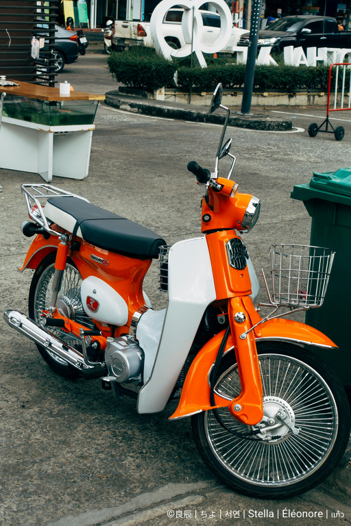

# ImageKit

[](https://github.com/hzbd/imagekit)
[](https://opensource.org/licenses/MIT)
[](https://www.rust-lang.org)

**ImageKit** is a powerful, fast, and flexible command-line tool for batch image processing. Written in Rust, it leverages parallel processing to maximize performance, allowing you to effortlessly resize, control the quality of, and add highly customizable watermarks to entire directories of images.

[中文](./README-zh.md)

## 🌟 Features

- **Batch Processing**: Recursively processes all images (`.jpg`, `.jpeg`, `.png`, `.gif`, `.bmp`，`.webp`) in a specified input directory.
- **Smart Scaling**:
    - If only a width is provided, the height is calculated automatically to maintain the aspect ratio.
    - If only a height is provided, the width is calculated automatically.
- **Quality Control**: Use the `-q` or `--quality` flag (1-100) to fine-tune the output quality, balancing file size and visual fidelity. Set to `100` for the best possible quality.
- **Powerful Watermarking**:
    - **Multi-language Support**: Perfectly renders watermarks with mixed text, supporting major world scripts including Latin (for English, French, Spanish), Cyrillic (for Russian), Thai, and CJK (Chinese, Japanese, Korean)..
    - **Highly Customizable**: Add text watermarks in nine standard positions and freely set the font size.
    - **Custom Colors**: Precisely control watermark color and opacity using hex codes (e.g., `RRGGBB` or `RRGGBBAA`).
    - **Intelligent Watermark Scaling**: If the requested watermark is too large for an image, it is automatically scaled down to fit perfectly, ensuring it is never cropped.
- **⚡ Blazing Fast Performance**: Utilizes the [Rayon](https://github.com/rayon-rs/rayon) library to process images in parallel, taking full advantage of multi-core CPUs.
- **Cross-Platform**: Compiles and runs on Windows, macOS, and Linux.

## ⚙️ Installation & Build

You will need to have [Rust and Cargo](https://www.rust-lang.org/tools/install) installed.

1.  **Clone the Repository**
    ```bash
    git clone https://github.com/hzbd/imagekit.git
    cd imagekit
    ```

2.  **Prepare Fonts**
    This tool uses a font fallback system for multi-language support. Please ensure the `assets/` directory contains:
    *   `Roboto-Regular.ttf` (for Western characters)
    *   A font with CJK support, such as `SourceHanSansSC-Regular.otf` (Source Han Sans). You can download it from [Adobe Fonts GitHub](https://github.com/adobe-fonts/source-han-sans/releases).

3.  **Build the Project**
    ```bash
    cargo build --release
    ```

4.  **Locate the Executable**
    After building, the executable will be located in the `target/release/` directory.

## 🚀 Usage

### Examples

#### Example 1: Add a watermark with mixed Chinese and English text
```bash
./target/release/imagekit \
    -i ./input_photos \
    -o ./processed_photos \
    --watermark-text "你好, World! - Test Watermark"
```

#### Example 2: Resize images and save at maximum quality
If you want to resize without quality loss for JPEGs, use `--quality 100`.
```bash
./target/release/imagekit -i ./input_photos -o ./processed_photos --width 1024 --quality 100
```

#### Example 3: Add an opaque black watermark (using default quality 85)
```bash
./target/release/imagekit \
    -i ./input_photos \
    -o ./processed_photos \
    --watermark-text "Confidential" \
    --watermark-color 000000FF
```

## 📋 Command-Line Options

| Option             | Flags                      | Description                                                               | Required/Optional | Default             |
| ------------------ | -------------------------- | ------------------------------------------------------------------------- | ----------------- | ------------------- |
| Input Directory    | `-i`, `--input-dir`        | The source directory containing images to process.                        | **Required**      | -                   |
| Output Directory   | `-o`, `--output-dir`       | The directory where processed images will be saved.                       | **Required**      | -                   |
| Width              | `--width`                  | (Optional) Resize image width. Scales proportionally if height is omitted. | Optional          | Original width      |
| Height             | `--height`                 | (Optional) Resize image height. Scales proportionally if width is omitted. | Optional          | Original height     |
| Watermark Text     | `--watermark-text`         | (Optional) The text content for the watermark.                            | Optional          | -                   |
| Watermark Position | `--watermark-position`     | (Optional) The position of the watermark on the image.                    | Optional          | `se`                |
| Font Size          | `--font-size`              | (Optional) The font size of the watermark text in pixels.                 | Optional          | `24`                |
| Watermark Color    | `--watermark-color`        | (Optional) Watermark color in RRGGBB or RRGGBBAA hex format.              | Optional          | `FFFFFF80` (semi-transparent white) |
| Quality            | `-q`, `--quality`          | (Optional) Set output quality (1-100). Affects JPEG and PNG compression.  | Optional          | `85`                |

#### Available values for `watermark-position`:

-   `nw`: North-West, `north`: North, `ne`: North-East
-   `west`: West, `center`: Center, `east`: East
-   `sw`: South-West, `south`: South, `se`: South-East

## Demo

```
./target/release/imagekit -i img-src \
    -o img-out/ \
    --width 512 \
    --watermark-text "©良辰 | ちよ | 서연 | Stella | Éléonore | แก้ว" \
    --watermark-position se \
    --font-size 18 \
    --watermark-color ffffffFF
```



## 🛠️ Development & Testing

If you'd like to contribute to the project:

1.  Clone the repository and prepare the fonts.
2.  Make your changes.
3.  Run tests to ensure all functionality is working as expected:
    ```bash
    cargo test
    ```

## 📜 License

This project is licensed under the [MIT License](LICENSE).
